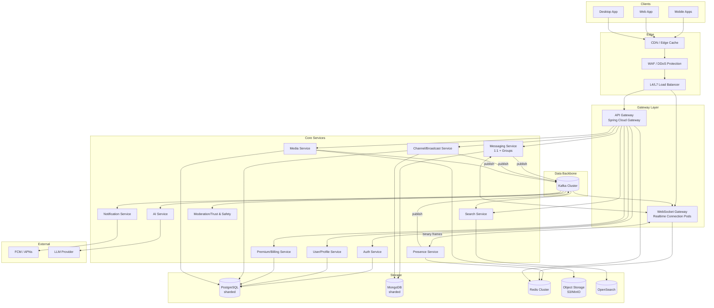
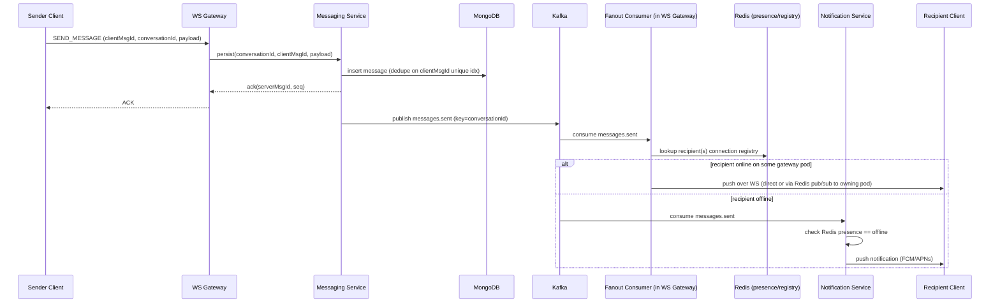
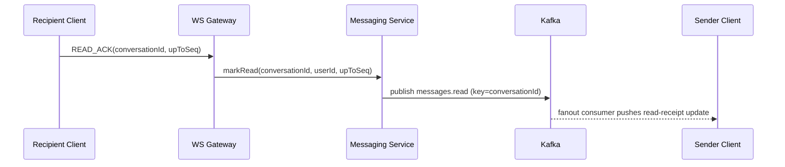
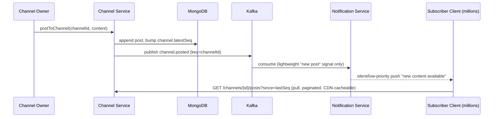
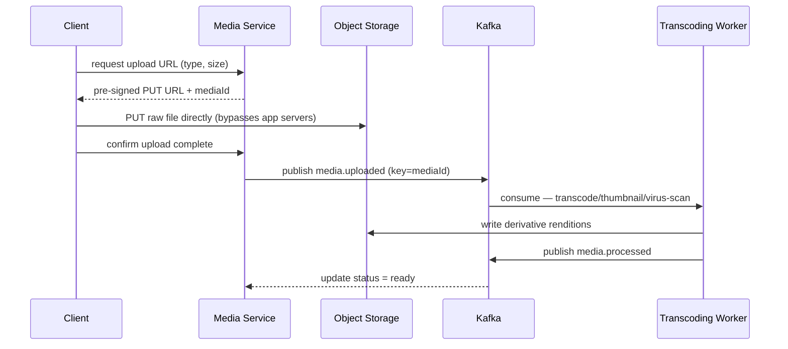
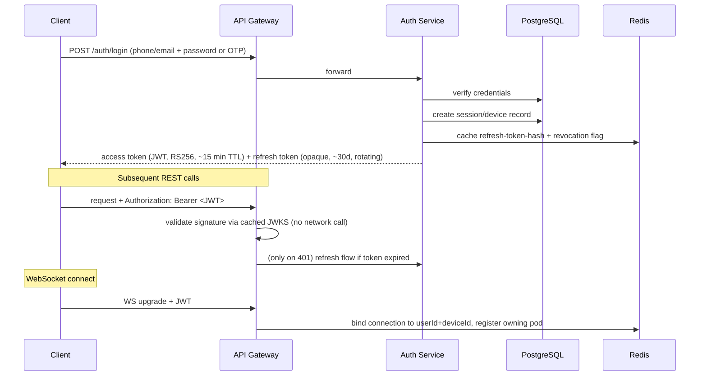

# Messaging Platform — System Architecture

**Status:** Design (no implementation yet)
**Stack:** Java 21 · Spring Boot 3 · PostgreSQL · MongoDB · Redis · Kafka · Docker · Kubernetes
**Scale target:** Telegram/WhatsApp/Discord/Slack-class — tens of millions of concurrent WebSocket connections, billions of messages/day, global user base.

---

## 1. Guiding Principles

1. **Database-per-service** — no service reaches into another service's schema. Cross-service reads go through APIs or denormalized event-driven caches.
2. **Two data planes** — a *relational plane* (Postgres) for anything with strong consistency/referential-integrity needs (identity, membership, billing), and a *document plane* (MongoDB) for high-volume, append-mostly, schema-flexible data (messages, timelines).
3. **Kafka is the system's nervous system** — services communicate state changes via events, not synchronous chains. Synchronous REST/gRPC is used only for request/response reads and the initial write path.
4. **Fan-out on write for small groups, fan-out on read (pull) for large channels** — you cannot push a message synchronously to 5 million channel subscribers; you can for a 200-person group.
5. **Everything that can be stateless, is stateless.** The only stateful runtime component in the request path is the WebSocket Gateway, and even its connection state lives in Redis, not in-process, so any pod can be killed without losing more than one client's socket.
6. **Idempotent by design** — at-least-once delivery everywhere (Kafka, push, WS redelivery); every consumer dedupes on a client-generated message UUID.

---

## 2. High-Level Architecture Diagram



---

## 3. Service Decomposition

| Service | Responsibility | Primary Store | Sync API | Async (Kafka) |
|---|---|---|---|---|
| **API Gateway** | AuthN token validation, routing, rate limiting, request aggregation | Redis (rate-limit counters) | REST/gRPC in, routes out | — |
| **WebSocket Gateway (Realtime Gateway)** | Holds client connections, frame (de)serialization, binds userId+deviceId → pod, delivers pushed events | Redis (connection registry) | WS | consumes `messages.*`, `presence.*`, `typing.*` |
| **Auth Service** | Registration, login, OTP, JWT issuance/rotation, refresh tokens, device/session registry, MFA | PostgreSQL | REST/gRPC | publishes `auth.session.*` |
| **User/Profile Service** | Profile, contacts, blocklist, privacy settings | PostgreSQL | REST/gRPC | publishes `user.updated` |
| **Messaging Service** | 1:1 + group message send/receive, conversation metadata, delivery/read receipts, message ordering (Snowflake IDs) | MongoDB (messages) + PostgreSQL (conversation/membership) | gRPC (internal), REST (history) | publishes `messages.sent/delivered/read` |
| **Channel/Broadcast Service** | Large-fan-out channels (public broadcast, unbounded subscriber counts) | MongoDB (posts) + PostgreSQL (channel metadata, subscriptions) | REST/gRPC | publishes `channel.posted`, `channel.subscription.changed` |
| **Group Management Service** | Group creation, roles/permissions, invites (can be embedded in Messaging Service or split out at scale) | PostgreSQL | REST/gRPC | publishes `group.membership.changed` |
| **Presence Service** | Online/offline, last-seen, typing indicators | Redis | REST (last-seen lookup) | publishes/consumes `presence.changed`, `typing.*` |
| **Media Service** | Upload orchestration, transcoding (voice/image/video), thumbnailing, virus scan, CDN URL issuance | Object Storage + PostgreSQL (metadata) | REST (pre-signed URL) | publishes `media.uploaded/processed` |
| **Notification Service** | Push notification delivery (FCM/APNs/WebPush), digest/batching, do-not-disturb rules | Redis (device tokens cache) + PostgreSQL (token registry) | — | consumes `messages.sent`, `channel.posted`; publishes `notif.sent` |
| **Search Service** | Full-text search over messages, users, groups, channels | OpenSearch (index) + Mongo (source of truth) | REST | consumes `messages.sent`, `user.updated`, `channel.posted` |
| **AI Service** | Smart replies, summarization, translation, semantic search assist, content moderation classifier | stateless (calls LLM) + Redis (result cache) | REST/gRPC | consumes `messages.sent`; publishes `ai.suggestion.ready`, `ai.moderation.flagged` |
| **Moderation / Trust & Safety** | Spam/abuse detection, report handling, takedowns | PostgreSQL | REST | consumes `ai.moderation.flagged`; publishes `moderation.action.taken` |
| **Premium/Billing Service** | Subscription tiers, entitlements, payment provider webhooks, feature flags | PostgreSQL | REST | publishes `billing.subscription.changed` |
| **Analytics/Audit Service** (optional) | Compliance logging, usage analytics | Mongo/columnar sink | — | consumes `audit.events` |

**Design note:** Group Management can start embedded inside the Messaging Service and be extracted later — don't over-decompose at day one. The hard boundary that must exist from the start is **Channels vs. Groups/1:1**, because their fan-out models are fundamentally different (pull vs. push).

---

## 4. Database Selection & Rationale

| Data | Store | Why |
|---|---|---|
| Users, credentials, sessions, devices | **PostgreSQL** | Strong consistency, unique constraints, relational integrity (foreign keys to memberships), transactions for account state changes |
| Group/channel metadata, membership, roles | **PostgreSQL** | Referential integrity (who's in what group), transactional membership changes |
| Billing/subscriptions/entitlements | **PostgreSQL** | ACID required for payment state |
| Messages (1:1, group, channel posts) | **MongoDB** | Extremely high write throughput, flexible schema (text/media/reactions/edits vary per message type), natural fit for append-only time-ordered documents, horizontal sharding by conversation |
| Media metadata | **PostgreSQL** (pointer table) + **Object Storage** (blob) | Metadata is relational (owner, ACL, expiry); blobs never belong in a database |
| Presence, last-seen, typing, sessions cache, rate limits | **Redis** | Sub-millisecond, TTL-native, pub/sub built in |
| Search index | **OpenSearch/Elasticsearch** *(supporting infra, not in the mandated list but required for the "search" requirement)* | Inverted index for full-text; Mongo/Postgres are not search engines |
| Event backbone | **Kafka** | Durable, replayable, ordered-per-key, decouples producers/consumers |
| Media blobs | **S3-compatible Object Storage (MinIO on-prem / S3 in cloud)** *(supporting infra implied by image/video/file sharing)* | Purpose-built for large binary objects + CDN origin |

---

## 5. Event Flow

### 5.1 One-to-one / group message send



### 5.2 Read receipt propagation



### 5.3 Channel (large fan-out) post — pull model



Channels never push full payloads to subscribers — only a cheap "there's something new" signal (or nothing, if the client polls/long-polls on reconnect). This is what makes a 10M-subscriber channel tractable.

### 5.4 Media upload



---

## 6. API Gateway

**Technology:** Spring Cloud Gateway (reactive, Netty-based) as the primary edge for REST/gRPC; a separate dedicated **WebSocket Gateway** service for realtime connections (a generic API gateway is the wrong tool for millions of long-lived stateful sockets).

Responsibilities:
- **TLS termination** (or pass-through to mesh sidecar if Istio handles it)
- **JWT validation** (signature check against cached JWKS; no DB hit per request)
- **Rate limiting** — Redis-backed token bucket per user/IP/API-key, tiered by premium status
- **Routing** — path/header-based routing to backend services via service discovery (K8s DNS)
- **Request aggregation** — for mobile clients, compose a few backend calls into one response (e.g., conversation list + presence + unread counts)
- **Circuit breaking / retries** — Resilience4j, fail fast to protect backends
- **API versioning** and **canary routing** (weighted routing to new service versions during rollout)
- **Observability** — inject trace headers (W3C traceparent), emit access logs to the tracing pipeline

The WebSocket Gateway is *not* behind the same gateway process — it sits behind an L4 load balancer (long-lived TCP, no request buffering) and does its own lightweight JWT validation on connection upgrade.

---

## 7. Authentication Flow



Key points:
- **Access tokens** are short-lived, stateless JWTs (RS256, keys rotated via JWKS endpoint) — validated at the edge with zero DB round-trips.
- **Refresh tokens** are opaque, stored hashed in Postgres, rotated on every use (reuse-detection ⇒ revoke whole session family — standard refresh-token-rotation attack mitigation).
- **Multi-device**: every login creates a distinct device/session row (WhatsApp/Telegram-style linked devices); revoking one device doesn't affect others.
- **MFA/OTP**: pluggable second factor for premium/enterprise accounts, delivered via the Notification Service.
- **Service-to-service auth**: mTLS via service mesh (Istio/Linkerd) inside the cluster; Kafka ACLs + SASL for broker auth; no service trusts a caller-supplied user ID without a validated JWT or mesh identity.

---

## 8. Scaling Strategy

| Layer | Strategy |
|---|---|
| **WebSocket Gateway** | Horizontally scaled Deployment behind L4 LB (no session affinity required); connection state lives in Redis so any pod can be killed/rescheduled without cascading disconnects beyond that pod's own sockets. HPA on custom metric = active connection count per pod. |
| **Stateless REST services** | Standard HPA on CPU + request latency (Prometheus Adapter). |
| **Kafka consumers** | KEDA-based scaling on consumer-group lag — a spike in `messages.sent` lag spins up more Notification/Search/AI consumer pods automatically. |
| **PostgreSQL** | Read replicas for read-heavy paths (profile lookups, membership checks); PgBouncer pooling; horizontal split via sharding (§9) once a single cluster's write throughput is the bottleneck. |
| **MongoDB** | Native sharded cluster from day one for the messages collection — this is the highest-volume data in the system. |
| **Redis** | Redis Cluster (hash-slot sharding) for horizontal capacity; separate physical clusters per concern (presence vs. rate-limit vs. cache) to isolate blast radius and let each scale independently. |
| **Media/CDN** | Media served via CDN, never through app servers; origin storage regionally replicated. |
| **Cross-region** | Assign each user a "home region" (data residency + latency); cross-region delivery via Kafka MirrorMaker2 relay topics; stateless services deployed active-active per region; WS Gateway connects clients to nearest region via GeoDNS/Anycast. |
| **Hot conversations** (viral group, celebrity channel) | Detect via metrics, apply per-conversation rate limiting and dedicated shard/partition affinity to avoid one hot key starving a Kafka partition or Mongo shard. |

---

## 9. Database Sharding Strategy

### PostgreSQL
- **Unit of sharding: `user_id`.** Use Citus (distributed Postgres extension) or an application-level "shard directory" service mapping `user_id → shard_id` (consistent hashing, ~4096 virtual shards mapped onto N physical clusters, so re-sharding = remapping virtual→physical, not rehashing everything).
- **Database-per-service** on top of that: Auth/User service owns its own Postgres cluster(s), Billing owns its own, Group-membership owns its own — no cross-service joins, ever.
- **Reference/lookup tables** (country codes, plan tiers) replicated to every shard — small, rarely-written.
- Group/channel membership rows are keyed by `group_id` but co-located by `user_id` shard for the *membership* side via a denormalized "my groups" table per user shard, while the canonical group record lives in a separate small "group directory" cluster (groups are far fewer than users, doesn't need the same sharding).

### MongoDB
- **Shard key: hashed(`conversationId`)** for the messages collection — spreads write load evenly, avoids monotonically-increasing-key hotspotting, and keeps all messages for one conversation on one shard so history queries don't fan out across shards.
- **Channels** get their own sharded collection keyed on hashed(`channelId`), with **zone sharding** so a small number of extreme-outlier channels (celebrity broadcast, 10M+ subscribers) can be pinned to dedicated, better-provisioned shards.
- **Bucket pattern**: instead of one document per message forever accumulating, messages are stored as-is (one doc per message, Mongo handles this fine at this volume) but old conversations roll into monthly time-partitioned collections for easier TTL/archival to cold storage.
- **Read preference**: `primary` for the latest N messages (consistency matters for "did my message send"), `secondaryPreferred` for infinite-scroll history.

---

## 10. Redis Strategy

Segmented into **independent physical clusters** so a spike in one doesn't degrade another:

1. **Presence cluster** — `presence:{userId}` → {status, lastSeenTs}, TTL-based heartbeat (client pings every ~25s; missed ping ⇒ auto-expire to offline). Pub/sub channel per user for presence-change fanout to interested contacts.
2. **Connection registry cluster** — `conn:{userId}:{deviceId}` → gatewayPodId, used by the fanout consumer to know which WS Gateway pod owns a socket; enables cross-pod delivery via Redis pub/sub or a lightweight internal gRPC push.
3. **Typing indicators** — `typing:{conversationId}:{userId}`, TTL 3–5s, no persistence needed at all; pure ephemeral pub/sub broadcast to conversation members.
4. **Rate limiting** — sliding-window/token-bucket counters via Lua scripts (atomic check-and-increment), tiered limits keyed by plan (free vs. premium).
5. **Cache-aside** — user profile cache, conversation metadata cache, "hot" last-50-messages-per-active-conversation cache to absorb read load before hitting Mongo; standard TTL + write-through invalidation via Kafka consumer (`user.updated`, `messages.sent` events evict/update cache).
6. **Distributed locks (Redlock)** — group-admin critical sections, dedup guards during retry storms.
7. **Feature-flag / entitlement cache** — synced from Postgres Billing service via `billing.subscription.changed` events, read on the hot path to gate premium features without a DB hit per request.

Persistence: presence/typing clusters run pure in-memory (no AOF/RDB — data is disposable by nature); cache and rate-limit clusters use AOF-everysec for warm-restart recovery; nothing in Redis is a system of record.

---

## 11. Kafka Event Design

| Topic | Key | Partitions (guide) | Retention | Producers | Consumers |
|---|---|---|---|---|---|
| `messages.sent.v1` | `conversationId` | ~300 | 7d | Messaging, Channel Service | WS Gateway (fanout), Notification, Search, AI, Analytics |
| `messages.delivered.v1` | `conversationId` | ~100 | 3d | WS Gateway | Messaging Service (state update), Analytics |
| `messages.read.v1` | `conversationId` | ~100 | 3d | Messaging Service | WS Gateway (fanout to sender) |
| `presence.changed.v1` | `userId` | ~150 | 1h | Presence Service | WS Gateway, Notification (DND logic) |
| `typing.changed.v1` | `conversationId` | ~50 | 5m | WS Gateway | WS Gateway (peers) — often bypassed via Redis pub/sub directly, Kafka only if durability across region matters |
| `channel.posted.v1` | `channelId` | ~100, zone-aware for hot channels | 14d | Channel Service | Notification, Search, AI, Analytics |
| `group.membership.changed.v1` | `groupId` | ~50 | 30d | Group Management | Messaging, Notification, Search |
| `channel.subscription.changed.v1` | `channelId` | ~50 | 30d | Channel Service | Notification, Analytics |
| `media.uploaded.v1` | `mediaId` | ~100 | 3d | Media Service | Transcoding workers |
| `media.processed.v1` | `mediaId` | ~100 | 3d | Transcoding workers | Media Service, Messaging (unblock message send if media-first) |
| `notifications.push.v1` | `userId` | ~200 | 1d | Notification Service (internal fanout stage) | Push-dispatch workers (FCM/APNs) |
| `ai.requests.v1` | `requestId` | ~100 | 1d | AI Service consumers | AI Service |
| `ai.suggestion.ready.v1` | `conversationId` | ~100 | 1d | AI Service | WS Gateway |
| `ai.moderation.flagged.v1` | `contentId` | ~50 | 30d | AI Service | Moderation/Trust & Safety |
| `billing.subscription.changed.v1` | `userId` | ~50 | 90d | Billing Service | Auth, Redis-cache updater, Notification |
| `audit.events.v1` | `userId` | ~50 | 1y+ (compliance) | all services | Analytics/Audit sink |
| `*.dlq` | mirrors source key | 1 per source topic | 14d | consumer error handlers | manual/automated replay tooling |

Design decisions:
- **Partition key = conversationId / channelId / userId** wherever ordering matters — Kafka only guarantees order within a partition, and message order within a single conversation is the one ordering guarantee that's non-negotiable.
- **Schema Registry (Protobuf)** for all topics — enforced backward compatibility, no breaking changes without a version bump (`.v2` topic or compatible field evolution).
- **Idempotent producers** (`enable.idempotence=true`) + **consumer-side dedup** on `clientMessageId` (unique index in Mongo) — end-to-end exactly-once is not attempted; at-least-once + idempotent consumers is the pragmatic target.
- **DLQ per consumer group** — poison messages never block a partition; alerting on DLQ depth.
- Sizing partitions for **peak sustained throughput / target-per-partition-throughput**, not arbitrary round numbers — start conservative (100–300) and repartition via a new topic version rather than repartitioning in place (repartitioning breaks key-ordering guarantees mid-flight).

---

## 12. Kubernetes Deployment Architecture

### Namespace layout
```
messaging     -> Messaging, Channel, Group services
realtime      -> WS Gateway, Presence Service
identity      -> Auth, User, Billing
media         -> Media Service, transcoding workers
intelligence  -> AI Service, Search Service, Moderation
platform      -> Kafka (Strimzi), Redis Operator, Postgres Operator, Mongo Operator
ingress       -> API Gateway, NGINX/Envoy ingress controller
observability -> Prometheus, Grafana, Loki, Tempo/Jaeger
```

### Workload types
- **Stateless services** (Auth, User, Messaging, Channel, Notification, Search, AI, Billing) → `Deployment` + `HorizontalPodAutoscaler`, `PodDisruptionBudget`, topology-spread across AZs, readiness/liveness probes tied to actual dependency health (DB/Kafka connectivity), rolling updates.
- **WS Gateway** → `Deployment` behind a dedicated L4 `Service` (`type: LoadBalancer`, `externalTrafficPolicy: Local` for source-IP preservation), scaled via KEDA/HPA on active-connection-count custom metric, `PodDisruptionBudget` with `maxUnavailable: 1` to avoid mass-disconnect during rollouts, graceful shutdown draining (SIGTERM → stop accepting new frames, flush in-flight, close sockets with reconnect hint) with a generous `terminationGracePeriodSeconds`.
- **Kafka** → **Strimzi Operator**, KRaft mode (no ZooKeeper), multi-broker `StatefulSet` with rack-awareness across AZs, dedicated fast-storage `StorageClass` (local NVMe or high-IOPS PV).
- **PostgreSQL** → **CloudNativePG** (or Zalando Postgres Operator), primary + N replicas per shard, automated failover, PgBouncer as a pooling sidecar/Deployment in front of each cluster.
- **MongoDB** → **MongoDB Community/Enterprise Operator**, full sharded topology (config server replica set, shard replica sets, `mongos` router `Deployment`) as `StatefulSets` with anti-affinity across nodes/AZs.
- **Redis** → Redis Operator, Cluster-mode `StatefulSet` per logical cluster (presence, cache, rate-limit) — small blast radius per cluster, independent scaling/tuning.

### Traffic & security
- **Service mesh (Istio or Linkerd)**: mTLS between all pods, fine-grained authorization policy (service A may call service B's specific endpoints only), circuit breaking, retries/timeouts as mesh policy rather than app code, canary traffic splitting.
- **Ingress**: NGINX or Envoy Gateway API at the edge, TLS termination, WAF in front (ModSecurity/Cloud WAF), rate limiting at the very edge as a first line of defense before the API Gateway's own limiter.
- **Secrets**: External Secrets Operator syncing from Vault/KMS — no secrets in manifests or images.

### Autoscaling & resilience
- **HPA** for CPU/latency-based stateless scaling; **KEDA** for Kafka-lag-driven consumer scaling; **Cluster Autoscaler / Karpenter** for node-level elasticity.
- **Argo Rollouts** for canary/blue-green deployments with automated analysis (error-rate/latency gates) before full rollout — critical for the WS Gateway and Messaging Service where a bad deploy has immediate user-visible impact.
- **Chaos testing** (pod-kill, AZ-failure drills) run regularly against the WS Gateway and Kafka to validate the "no state lost beyond directly-affected pod" guarantee.

### Observability
- **OpenTelemetry SDK** in every Spring Boot service, exported to **Tempo/Jaeger** for distributed tracing across the async Kafka boundary (trace context propagated in event headers).
- **Prometheus + Grafana** for metrics (including the custom metrics HPA/KEDA depend on).
- **Loki/ELK** for centralized logs, correlated to trace IDs.

### Multi-region
- Each region runs a full stack (its own Kafka, its own regional Postgres/Mongo shards for its home users); **Kafka MirrorMaker2** replicates cross-region-relevant events (e.g., a message between users in different home regions) into the recipient's home-region cluster; GeoDNS/Anycast routes clients to the nearest region for the WS Gateway; disaster recovery via warm-standby region with continuous replication.

---

## 13. Premium & AI Features — Cross-Cutting Notes

- **Premium tier** is not a separate service boundary from the feature it gates — it's an **entitlement check** (cached in Redis, sourced from the Billing Service via `billing.subscription.changed` events) consulted at the API Gateway and inside services for: higher rate limits, larger group sizes, larger file-upload limits, priority push delivery, AI-feature access, extended message-edit/unsend windows.
- **AI features** (smart replies, summarization, translation, semantic search) are deliberately **asynchronous and best-effort** — they consume `messages.sent` off Kafka and publish suggestions back (`ai.suggestion.ready`) rather than sitting in the critical send path, so an LLM provider outage never blocks message delivery.
- **Moderation** (spam/abuse classification) can run either inline (fast heuristic/ML classifier, synchronous, on the send path with a tight latency budget) or async (deeper LLM-based review, off Kafka, action taken after the fact) — a hybrid of both is standard practice at this scale.

---

## 14. What's Deliberately Not Decided Yet

This document is architecture, not implementation. Left open for the design-review/implementation phase:
- Exact Snowflake/ID-generation scheme (Twitter Snowflake vs. MongoDB ObjectId vs. ULID) for message ordering.
- Choice of Citus vs. application-level shard directory for Postgres.
- Specific LLM provider(s) and whether AI inference is self-hosted or API-based.
- Exact partition counts (given as sizing guidance, to be tuned against real throughput benchmarks).
- Push notification provider abstraction details (FCM/APNs/WebPush unification layer).
